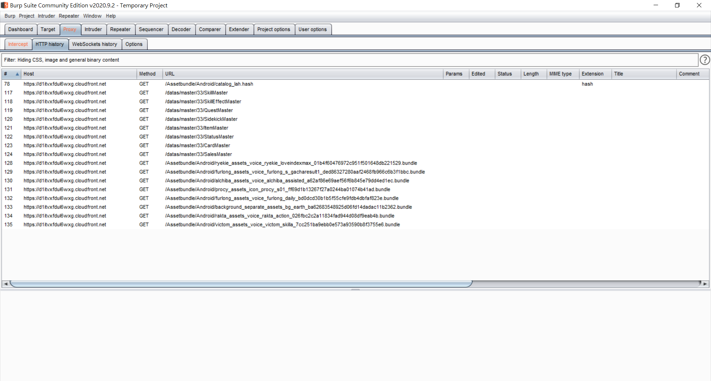

## Requirements

* Android Emulator: [MEmu](https://www.memuplay.com/) (built-in rooted)
  * App: [Root Certificate Manager(ROOT)](https://play.google.com/store/apps/details?id=net.jolivier.cert.Importer)
* Packet Capture: [Burp Suite Community Edition](https://portswigger.net/burp/communitydownload) 

> Reference video: [How to Proxy Android Apps](https://www.youtube.com/watch?v=_nPy5MhtNk0)



## Artifacts

### Current Version

#### cURL

```shell
curl -i -s -k -X $'GET' \
  -H $'Host: gateway.live-a-hero.jp' \
  -H $'Accept: */*' \
  -H $'Accept-Encoding: gzip, deflate' \
  -H $'User-Agent: LiveAHeroAPI/1.0.3 Android OS 7.1.2 / API-25 (N2G48H/rel.se.infra.20200730.150525) google G011A' \
  -H $'X-Unity-Version: 2019.4.10f1' \
  -H $'Connection: close' \
  $'https://gateway.live-a-hero.jp/api/status/version'
```

##### Response

```
HTTP/2 200
date: Thu, 15 Oct 2020 06:56:58 GMT
content-type: application/json
server: nginx
cache-control: no-cache, private

{"result":true,"message":"","client":"1.0.3","master":33}
```

### Android Asset Catalog Hash

* API: **GET** `https://d1itvxfdul6wxg.cloudfront.net/datas/master/<app-version>/<file-type>`

#### cURL

a simpler request

```shell
curl -s -H 'User-Agent: LiveAHeroAPI' \
  'https://gateway.live-a-hero.jp/api/status/version'
```

```shell
curl -i -s -k -X $'GET' \
  -H $'Host: d1itvxfdul6wxg.cloudfront.net' \
  -H $'User-Agent: UnityPlayer/2019.4.10f1 (UnityWebRequest/1.0, libcurl/7.52.0-DEV)' \
  -H $'Accept: */*' \
  -H $'Accept-Encoding: gzip, deflate' \
  -H $'X-Unity-Version: 2019.4.10f1' \
  -H $'Connection: close' \
  $'https://d1itvxfdul6wxg.cloudfront.net/Assetbundle/Android/catalog_lah.hash'
```

##### Response

```
HTTP/2 200
content-type: binary/octet-stream
content-length: 32
last-modified: Fri, 09 Oct 2020 05:23:28 GMT
accept-ranges: bytes
server: AmazonS3
date: Thu, 15 Oct 2020 03:07:43 GMT
etag: "e26fba311f2e896b19395adbfb76259d"
x-cache: Hit from cloudfront
via: 1.1 7c49a9b1de541df168365abd214691ff.cloudfront.net (CloudFront)
x-amz-cf-pop: TPE51-C1
x-amz-cf-id: wevKi51D_ijovd3HJ-gNk8A1V84PKkmL36dYLVrx981alHnhA1tAiQ==
age: 14357

b0bf559db77392afd4a3d52e60ac6e2d
```

### Get Master Data

* API: **GET** `https://d1itvxfdul6wxg.cloudfront.net/datas/master/<app-version>/<file-type>`
* file-type
  * `SkillMaster`
  * `SkillEffectMaster`
  * `QuestMaster`
  * `SidekickMaster`
  * `ItemMaster`
  * `StatusMaster`
  * `CardMaster`
  * `SalesMaster`

#### cURL

```shell
curl -i -s -k -X $'GET' \
  -H $'Host: d1itvxfdul6wxg.cloudfront.net' \
  -H $'Accept: */*' \
  -H $'Accept-Encoding: gzip, deflate' \
  -H $'User-Agent: LiveAHeroAPI/1.0.3 Android OS 7.1.2 / API-25 (N2G48H/rel.se.infra.20200730.150525) google G011A' \
  -H $'X-Unity-Version: 2019.4.10f1' \
  -H $'Connection: close' \
  $'https://d1itvxfdul6wxg.cloudfront.net/datas/master/33/SkillMaster'
```

##### Response

```
HTTP/2 200
content-type: binary/octet-stream
content-length: 188949
date: Thu, 15 Oct 2020 04:33:07 GMT
last-modified: Fri, 09 Oct 2020 06:56:07 GMT
etag: "97f14fc5502919ca171f5f9acc6691d2"
accept-ranges: bytes
server: AmazonS3
x-cache: Hit from cloudfront
via: 1.1 7891adc32031b195876d8abd43962d02.cloudfront.net (CloudFront)
x-amz-cf-pop: TPE51-C1
x-amz-cf-id: Io_FOP5R4wilclYSD1xfjV0GvYVQeuLVybOI2GY6b28SyiMsUE-FEA==
age: 9382

{
  "1": {
    "skillId": 1,
    "skillName": "ウェイト",
    "useView": 0,
    "targetFlag": 0,
    "resourceName": "b_skill_wait",
    "subResourceName": "",
    "timing": 0,
    "description": "自身に1ターンの間ウェイトを付与。もう１度行動をする。",
    ... (SKIP)
```

### Get bundles

An example:

* `https://d1itvxfdul6wxg.cloudfront.net/Assetbundle/Android/ryekie_assets_voice_ryekie_loveindexmax_01b4f60476972c951f501648db221529.bundle`
